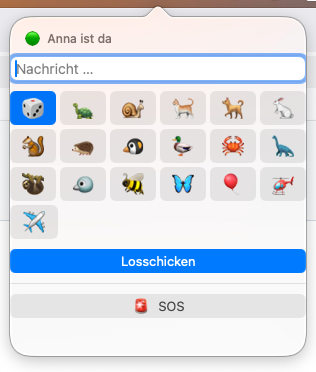

# MiniSignal

**Kurznachrichten, die von Tieren über den Desktop getragen werden.**
Für Macs im selben WLAN — kein Server, kein Konto, nichts im Internet.


Du tippst oben in der Menüleiste eine Zeile, und drüben spaziert sie über den
Bildschirm: eine Schildkröte mit Schild auf dem Panzer, ein hüpfender Hase, ein
Flugzeug mit Schleppbanner. 18 Boten stehen zur Auswahl, 🎲 würfelt jedes Mal neu.
Dazu ein SOS-Knopf, der beim anderen sofort den ganzen Bildschirm rot blinken lässt.

Der Desktop bleibt dabei ganz normal bedienbar — die Overlays lassen Mausklicks
durch, und die Animation läuft in Core Animation, kostet also kaum Rechenzeit.


<table>
<tr>
<td width="34%"></td>
<td></td>
</tr>
<tr>
<td><em>Schreiben und Boten wählen</em></td>
<td><em>SOS: der ganze Bildschirm blinkt rot, bis der andere klickt</em></td>
</tr>
</table>

## Installation

**Fertige App:** das ZIP aus dem [neuesten Release](https://github.com/harsting/minisignal/releases/latest)
laden, `MiniSignal.app` nach *Programme* ziehen, öffnen.

macOS meldet beim ersten Start, es könne die App nicht auf Schadsoftware prüfen —
sie ist nicht bei Apple registriert, weil sie niemand verkauft. Dann in
*Systemeinstellungen → Datenschutz & Sicherheit* ganz nach unten scrollen und auf
**„Trotzdem öffnen"** klicken. Nur beim ersten Mal.

**Selbst bauen** (braucht nur die Command Line Tools, kein Xcode):

```bash
git clone https://github.com/harsting/minisignal.git
cd minisignal && ./build.sh && open MiniSignal.app
```

### Einrichtung

Beim ersten Start fragt die App nach:

- **Name** — wie du bei den anderen angezeigt wirst.
- **Paar-Code** — muss auf allen Geräten **exakt gleich** sein. Er verschlüsselt die
  Nachrichten und sorgt dafür, dass sonst niemand im WLAN mitliest oder euch etwas
  schickt. Denkt euch etwas aus, das nur ihr kennt.
- Optional: Töne, Kurzbefehl, Start bei der Anmeldung.

Danach fragt macOS einmal, ob MiniSignal **im lokalen Netzwerk nach Geräten suchen**
darf. Das muss erlaubt werden — sonst finden sich die Macs nie. Nachträglich änderbar
unter *Systemeinstellungen → Datenschutz & Sicherheit → Lokales Netzwerk*.

## Updates

Das Projekt liegt auf GitHub. Auf **jedem** Mac genügt danach ein Doppelklick auf
`update.command` — das holt die neue Version, baut sie, installiert sie nach
`/Applications` und startet MiniSignal neu.

Auf einem weiteren Mac einmalig einrichten:

```bash
git clone https://github.com/harsting/minisignal.git ~/Desktop/minisignaltool
cd ~/Desktop/minisignaltool && ./update.command
```

Danach reicht der Doppelklick auf `update.command`. Weil das Repo öffentlich ist, braucht ihr Mac dafür
keine Anmeldung. Im Repo steht nichts Vertrauliches: euer Paar-Code liegt nur lokal
in den Einstellungen des jeweiligen Macs, nie im Code.

## Bedienung

| | |
|---|---|
| 💌 in der Menüleiste | Fenster zum Schreiben öffnen |
| ⌃⌥Leertaste | dasselbe, ohne Maus — in den Einstellungen umlegbar oder ganz abschaltbar |
| Emoji-Reihe | Boten wählen; 🎲 würfelt jedes Mal neu |
| ⏎ | losschicken |
| 🚨 SOS | rot blinkendes Overlay beim anderen |
| Rechtsklick aufs Icon | Einstellungen, Einladung, letzte Nachrichten, Testnachricht an mich, Beenden |

Die Statuszeile oben im Fenster zeigt, ob der andere Mac gerade erreichbar ist.
Ist er das nicht (zugeklappt, anderes WLAN), kommt sofort eine ehrliche Fehlermeldung —
Nachrichten werden **nicht** aufgehoben und später zugestellt.

Nachdem ein Bote durchgelaufen ist, taucht unten rechts kurz ein Antwortfeld auf.
Wer nicht antwortet, wird es nach ein paar Sekunden wieder los.

Beim SOS blinkt der Bildschirm des anderen so lange rot, bis er klickt oder ESC
drückt — dann steht bei dir „✓ … hat das SOS gesehen". Nach 20 Sekunden hört es
von selbst auf.

## Die Boten

| Am Boden | | In der Luft | |
|---|---|---|---|
| 🐢 Schildkröte | kriecht, Schild auf dem Panzer | 🐦 Vogel | Wellenflug |
| 🐌 Schnecke | am langsamsten, mit Schleimspur | 🐝 Biene | schneller Zickzack |
| 🐈 Katze | schlendert | 🦋 Schmetterling | gemächliches Flattern |
| 🐕 Hund | rennt und hüpft | 🎈 Luftballon | steigt auf, Zettel an der Schnur |
| 🐇 Hase | echte Sprungbögen | 🚁 Hubschrauber | mit Schleppbanner |
| 🐿️ Eichhörnchen | kleine schnelle Sprünge | ✈️ Flugzeug | mit Schleppbanner |
| 🦔 Igel | trippelt | | |
| 🐧 Pinguin | watschelt | | |
| 🦆 Ente | watschelt | | |
| 🦀 Krabbe | seitwärts | | |
| 🦕 Dino | schwere Schritte | | |
| 🦥 Faultier | hängt am Ast, 20 Sekunden | | |

## Mehrere Monitore

Der Bote läuft auf dem Bildschirm, auf dem gerade der Mauszeiger steht — jedes
Overlay ist ein eigenes Fenster, das exakt auf diesen einen Monitor passt. Beim SOS
blinkt dagegen jeder angeschlossene Bildschirm, die Karte erscheint auf dem aktiven.

Wenn Boten unsichtbar bleiben oder am falschen Rand kleben, zeigt dieser Befehl die
Bildschirmanordnung und alle Bahnhöhen:

```bash
MINISIGNAL_DIAGNOSE=1 /Applications/MiniSignal.app/Contents/MacOS/MiniSignal
```

## Mehr als zwei Geräte

Es dürfen beliebig viele mitmachen — alle mit demselben Paar-Code bilden einen Kreis
und sehen sich gegenseitig. Sind mehr als zwei da, erscheint im Fenster eine Auswahl:
an alle schicken oder gezielt an eine Person. Das gilt auch fürs SOS.

Wer einen **anderen** Code einträgt, bildet einen eigenen Kreis und hat mit euch
nichts zu tun — selbst im selben WLAN sehen sich die beiden Gruppen nicht. Dafür
steht im Bonjour-Eintrag ein Fingerabdruck des Codes (nicht der Code selbst), und
Geräte mit abweichendem Fingerabdruck werden ignoriert.

## Jemanden einladen

Rechtsklick aufs 💌 → **Jemanden einladen …**. Das erzeugt einen fertigen Text mit
Download-Link, Einrichtungshinweisen und einem Beitritts-Link der Form
`minisignal://join?code=…&from=…`. Ein Klick darauf trägt den Code beim Eingeladenen
ein — nach Rückfrage, nichts passiert stillschweigend.

Der Text enthält euren Paar-Code. Wer ihn hat, kann mitschreiben und mitlesen — also
nur an Leute schicken, die dazugehören sollen. Soll jemand die App bloß für sich und
seinen eigenen Partner nutzen, gibt er beim Einrichten einfach einen eigenen Code ein.

## Technik in drei Sätzen

Jede Instanz meldet sich per Bonjour als `_minisignal._tcp` im lokalen Netz an und
sucht gleichzeitig nach der Gegenstelle. Nachrichten gehen über eine direkte
TCP-Verbindung, jede einzelne mit AES-GCM verschlüsselt; der Schlüssel wird per
HKDF aus dem gemeinsamen Paar-Code abgeleitet, und Sendungen, die sich nicht
entschlüsseln lassen oder älter als zwei Minuten sind, werden verworfen.
Die Overlays sind randlose, mausdurchlässige Fenster über allen Spaces, deren
Animation komplett in Core Animation läuft — der Desktop bleibt bedienbar und der
Akku unbeeindruckt.

## Für Entwickler

| Befehl | wozu |
|---|---|
| `./build.sh` | baut `MiniSignal.app` im Projektordner |
| `./update.command` | holt, baut, installiert nach `/Applications`, startet neu |
| `./release.sh` | packt ein ZIP fürs GitHub-Release |
| `./make_icon.sh` | zeichnet `Resources/MiniSignal.icns` neu |
| `MINISIGNAL_DIAGNOSE=1 …/MiniSignal` | Bildschirmanordnung und Bahnhöhen ausgeben |
| `MINISIGNAL_SPRITESHEET=/tmp/b.png …/MiniSignal` | alle Boten mit Laufrichtung als Bild |

Weitere Schalter für Tests: `MINISIGNAL_SUITE` trennt die Einstellungen (mehrere
Instanzen auf einem Mac), `MINISIGNAL_DEMO=<bote|sos|popover>` zeigt etwas lokal,
`MINISIGNAL_DEMO_BACKDROP=1` legt eine neutrale Fläche darunter (für Screenshots),
`MINISIGNAL_MUTE=1` schaltet Töne ab.

## Beide Rollen auf einem Mac testen

```bash
open -n --env MINISIGNAL_SUITE=a --env MINISIGNAL_NAME=Anna \
        --env MINISIGNAL_CODE=testcode MiniSignal.app
open -n --env MINISIGNAL_SUITE=b --env MINISIGNAL_NAME=Marvin \
        --env MINISIGNAL_CODE=testcode MiniSignal.app
```

`MINISIGNAL_SUITE` trennt die Einstellungen, sodass zwei unabhängige Instanzen
nebeneinander laufen. Weitere Test-Schalter: `MINISIGNAL_DEMO=<boten-id|sos>`
zeigt einen Auftritt lokal, `MINISIGNAL_MUTE=1` schaltet Töne ab.

## Neue Tiere

`Sources/MiniSignal/Overlay/Carriers.swift` — ein Bote sind zehn Zeilen: Emoji,
Dauer, Bewegungsstil, wo die Nachricht hängt, auf welcher Höhe er läuft.
Statt `.emoji("🐢")` geht auch `.image(name: "fuchs.png")`; solche Dateien kommen
nach `Resources/Carriers/` und landen beim nächsten `./build.sh` im Bundle.

**Achtung Blickrichtung:** Apple-Emoji schauen nicht alle in dieselbe Richtung —
🐢 und 🐦 nach links, 🐌 und 🐕 nach rechts. `travelsRight` muss dazu passen, sonst
läuft das Tier rückwärts. Zum Nachsehen:

```bash
MINISIGNAL_SPRITESHEET=/tmp/boten.png ./MiniSignal.app/Contents/MacOS/MiniSignal
open /tmp/boten.png
```

Das rendert alle Boten nebeneinander mit ihrer eingestellten Laufrichtung.
Für eigene Bilddateien gibt es alternativ `mirrored: true`, das spiegelt das Sprite.

## Eine Version zum Herunterladen bauen

```bash
./release.sh
```

Das baut die App und packt sie als `MiniSignal-<version>.zip`. Das Skript zeigt am
Ende den `gh release create`-Befehl zum Hochladen. Weil die App nicht bei Apple
notarisiert ist, blockiert macOS sie beim ersten Öffnen. Der Empfänger muss dann in
*Systemeinstellungen → Datenschutz & Sicherheit* auf „Trotzdem öffnen" klicken —
der Rechtsklick-auf-Öffnen-Trick funktioniert seit macOS 15 nicht mehr. Das steht so
auch im Einladungstext.

## Wenn es klemmt

- **„Niemand gefunden", obwohl beide Macs laufen** — meistens die Freigabe für das
  lokale Netzwerk. Prüfen unter *Systemeinstellungen → Datenschutz & Sicherheit →
  Lokales Netzwerk*. Nach einem Neubau der App kann die Frage erneut kommen, weil
  macOS die Freigabe an die Signatur bindet.
- **Gastnetz oder Hotel-WLAN** — viele Router trennen die Geräte voneinander
  („Client Isolation"). Dann geht es nur im eigenen Heimnetz.
- **„MiniSignal kann nicht geöffnet werden"** — passiert, wenn die fertige App vom
  anderen Mac kopiert wurde. Am saubersten ist, `./build.sh` einmal auf jedem Mac
  laufen zu lassen. Alternativ: `xattr -dr com.apple.quarantine MiniSignal.app`.
